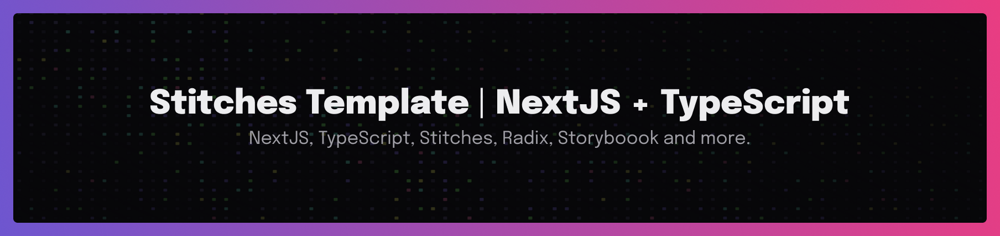
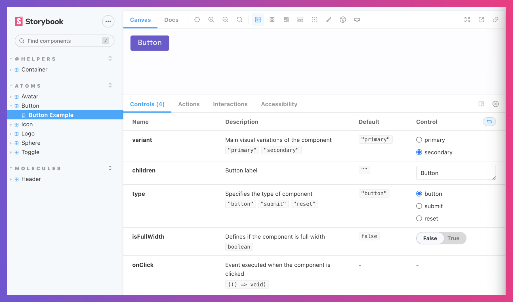

# Awesome Stitches Template — NextJS, TypeScript, Stitches and Design Tokens



---
## Summary

  - [About this template](#about-this-template)
  - [Avaliale scripts](#avaliale-scripts)
    - [Other scripts available](#other-scripts-available)
  - [Main technologies used](#main-technologies-used)
    - [radix](#radix)
    - [stitches](#stitches)
    - [storybook](#storybook)
    - [typescript](#typescript)
  - [About me](#about-me)
      - [#followMyWork](#followmywork)

## About this template

This project is a template for NextJS with TypeScript projects. This template was built with `create-next-app`, `typescript`, `stitches`, `@radix-ui` and `storybook`.

---

## Avaliale scripts

At first, in the project directory, you need run:

```jsx
// installing the dependencies
yarn
```

### Other scripts available

```jsx
// run project on http://127.0.0.1:5173/
yarn dev
```

_Run the app in the development mode by opening [ http://localhost:3000/]( http://localhost:3000/) to view it in the browser. The page will reload if you make edits._

```jsx
// build project
yarn build
```

```jsx
// preview project
yarn start
```
```jsx
// runs the linter in all src/ files
yarn lint
```

```jsx
// generate components quickly. e.g. to generate a <Button /> component, run:
yarn generate button
```

```jsx
// run storybook on http://localhost:6006/
yarn storybook
```


_Learn how to install `yarn` through the [official documentation](https://yarnpkg.com/)._

---

## Main technologies used

- [x] NextJS
- [x] TypeScript
- [x] Stitches
- [x] Radix UI Colors
- [x] Storybook
- [x] ESLint
- [x] Prettier
- [x] Husky
- [x] Commitlint
- [x] Lint-staged
- [x] Light / Dark theme
- [x] Automated component creation


### [radix colors](https://www.radix-ui.com/colors)
> An open-source color system for designing beautiful, accessible websites and apps.

### [stitches](https://stitches.dev/)
> CSS-in-JS with near-zero runtime, SSR, multi-variant support, and a best-in-class developer experience.

### [storybook](https://storybook.js.org/)
> Storybook is a frontend workshop for building UI components and pages in isolation.

### [typescript](https://www.typescriptlang.org/)
> TypeScript is JavaScript with syntax for types.

---

## About me

I'm Diego Silva, Senior Frontend Developer at [Neon Bank](https://neon.com.br/) with focus on improving the Developer Experience and Community Manager at [@99juniors](https://github.com/99juniors).

---

#### #followMyWork

[](https://twitter.com/diegosilvatech)
[](https://linkedin.com/in/diegosilvatech)
[](https://linktr.ee/diegosilvatech)
[](https://www.youtube.com/channel/UCECVV8ODiaQtur7EyS73i1g/videos)
[](https://www.twitch.tv/diegosilvatech)
[](https://discord.com/invite/P5YmPENeqd)